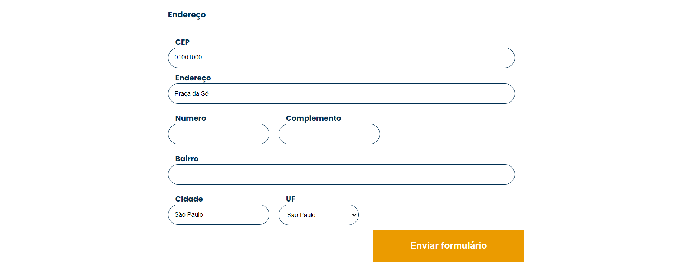

# AluraBooks consumindo API





Desenvolvido para aprendizado. 26/01/2023
Realizado durante aula de JavaScript uso de API. 


[🔗 Clique aqui para acessar] (https://michel-maia.github.io/AluraBooks-consumindo-API/)


## 💻 Tecnologias

- HTML
- CSS
- JavaScript 


## Referência

- [alura] [https://www.alura.com.br/]
- [alura] [https://www.alura.com.br/artigos/comecando-com-fetch-no-javascript]
- [MDN] [https://developer.mozilla.org/en-US/docs/Web/API/Web_Speech_API/Using_the_Web_Speech_API]
- [MDN] [https://developer.mozilla.org/pt-BR/docs/Web/JavaScript/Reference/Global_Objects/Promise]


### API
API é uma sigla que significa Interface de Programação de Aplicações. Uma API é um mecanismo que permite que duas partes de um software se comuniquem usando um conjunto de definições e protocolos. Sua arquitetura geralmente é explicada em termos de cliente e servidor. A aplicação que envia a solicitação é chamada de cliente e a aplicação que envia a resposta é chamada de servidor.

### Anatomia da promise
````js
const entrega = new Promise(function
(resolve, reject) {
    if (recebeu == true) {
        resolve('Recebeu encomenda')
    } else {
        reject ('Não recebeu')
    }
})

````

